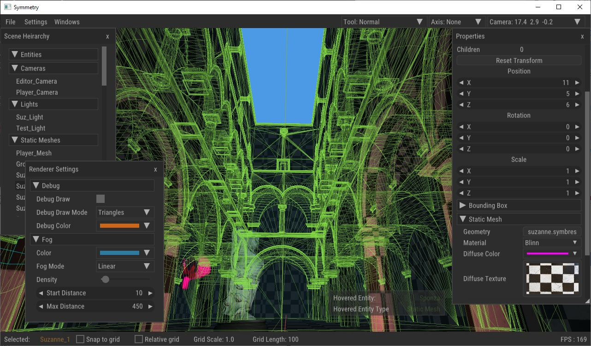

# Project Symmetry



## About

A simple first person shooter that may or may not have anything to do with the concept of symmetry.
The game has a similar structure to older games like Quake where the objective is usually to survive and get to end of the level while killing monsters/demons.
The purpose of this project is to serve as an exercise in creating a game from the ground up using as few libraries as possible. The game uses the following 
libraries:

| Library                                      | Usage                                   |
| ---------------------------------------------| --------------------------------------- |
| [SDL2](https://www.libsdl.org/)              | Windowing, Input, Platform abstraction  |
| [Soloud](http://sol.gfxile.net/soloud/)      | 3d positional audio                     |
| [ODE](http://ode.org/)                       | Physics                                 |
| [Nuklear](https://github.com/vurtun/nuklear) | In-game and editor UI                   |
| [GLAD](https://github.com/dav1dde/glad-web)  | OpenGL Extension Loading                |

For more information visit the development blog at my website: [Link](http://shariqshah.com/tags/project-symmetry/)

Binary builds are available on the project's Itch.io page: [Link](https://bluerriq.itch.io/symmetry)
## Building

The game uses the [GENie](https://github.com/bkaradzic/GENie) build system. The game can be build by llowing steps:

-**Windows**: Execute the following command in the project's root directory by opening a visual studio veloper command prompt:

  ```shell
  cd build
  ..\tools\genie.exe vs2017
  ```

This will generate a visual studio 2017 solution in the *build/vs2017* folder which can be opened in sual studio and built and run as ususal.

-**Linux(Ubuntu)**: Execute the following in the project's root directory

  ```bash
  cd build
  ../tools/genie gmake
  ```

  This will generate makefiles in the *build/gmake* directory. Then,

  ```bash
  cd gmake
  make all
  ```

  This will build the debug configuration by default and it's output will be in *build/gmake/debug* folder. You can then run the game by,

  ```bash
  cd debug
  ./Symmetry
  ```

## License

All the code in this repository is under GPLv3, see LICENSE for more information

## File format specifications

- ### Entity
  The following example shows an entity definition. When saved into a separate file, this forms the blueprint for 
  an entity which can be used to create multiple entities that follow the same definition.
  Sample entity definition, parameters left out are set to defaults when possible:

  ```C
  Entity
  {
  	type : 6
  	material : 0
  	diffuse_color : 1.000 1.000 1.000 1.000
  	geometry : sponza.symbres
  	specular : 1.0000
  	active : true
  	diffuse_texture : default.tga
  	diffuse : 1.0000
  	specular_strength : 1.0000
  	name : Sponza
  }

  ```
  When saving a scene that contains entities created from entity archetypes, each of those entities are saved as a "Scene_Entity_Entry"
  to signify that these are to be loaded from a separate file. Example of a scene entity entry for the entity defined above might 
  look like this 

  ```C
  Scene_Entity_Entry
  {
  	scale : 3.000 3.000 3.000
  	rotation : 0.000 0.000 0.000 1.000
  	position : -13.000 1.000 1.000
  	filename : Sponza
  	name : Sponza
  }
  ```

- ### Configuration Variables 

  These are the first parameters loaded when the game launches. If the game cannot find "config.symtres" file either in the game's installation directory or in the default operating system specific application directory, the game will generate a configuration file with default values and save it. An example config file, values left out are set to default:

  ```C
  Config
  {
    render_width: 1024
    render_height: 1024
    debug_draw_enabled: true
    fog_color: 0.5 0.2 0.2 1
    ambient_light: 0.1 0.1 0.1 1
    msaa: true
    msaa_levels: 8
  }
  ```

- ### Keybindings

  Keybindings file contains the definition of all keybindings. Each "Key" block contains definition for 
  a named input mapping. The mapping can have two keys which can activate it. All keys are parsed by comparing the output of SDL_GetKeyname.

  The following example shows an input mapping called "Move_Down":

  ```C
  Key
  {
  	mods_secondary_alt : false
  	key_primary : E
  	mods_primary_ctrl : false
  	mods_secondary_shift : false
  	key_secondary : NONE
  	mods_secondary_ctrl : false
  	mods_primary_shift : false
  	name : Move_Down
  	mods_primary_alt : false
  }
  ```
  This can then be used from within the game with:

  ```C
  enum Key_State
  {
  	KS_INACTIVE,
  	KS_PRESSED,
  	KS_RELEASED
  };

  // Returns true if the state of the input mapping matches the parameter 'state'
  // which should be a value from the enum "Key_State"
  bool input_map_state_get(const char* map_name, int state);
  ```
  If no keybindings are found when the game launches, the game generates a file with default key mappings.

- ### Level/Scene

  A scene file consists of definition of global scene parameters in a "Scene_Config" block along with the player definition. 
  This is then followed by entities which can either be a Scene_Entity_Entry or just a plain Entity. 
  Scene_Entity_Entry refers to the filename from where the entity should be loaded first and then have the parameters
  within the Scene_Entity_Entry block applied to it. 

  Every scene alwas contains a default player which is defined in code however a Player block contains definitions
  for player attributes that are applied to player when the scene is loaded.

  The following example shows a scene with the player and a light entity called "Test_Light":

  ```C
  Scene_Config
  {
  	debug_draw_color : 0.800 0.400 0.100 1.000
  	fog_type : 1
  	fog_density : 0.1000
  	fog_color : 0.170 0.490 0.630
  	debug_draw_physics : false
  	fog_start_distance : 10.0000
  	fog_max_distance : 450.0000
  	debug_draw_enabled : false
  	debug_draw_mode : 0
  	ambient_light : 0.100 0.100 0.100
  }

  Player
  {
  	type : 2
  	scale : 1.000 1.000 1.000
  	rotation : 0.000 0.771 0.000 0.636
  	active : true
  	position : 21.479 5.660 -3.077
  	name : Player
  	camera_clear_color : 0.600 0.600 0.900 1.000
  }
  
  Entity
  {
  	type : 5
  	scale : 1.000 1.000 1.000
  	inner_angle : 20.0000
  	falloff : 1.5000
  	light_type : 2
  	depth_bias : 0.0005
  	rotation : 0.000 0.000 0.000 1.000
  	cast_shadow : false
  	intensity : 1.0000
  	color : 1.000 1.000 1.000
  	active : true
  	radius : 20.0000
  	position : 0.000 5.000 0.000
  	outer_angle : 30.0000
  	name : Test_Light
  	pcf_enabled : false
  	valid : true
  }
  ```

